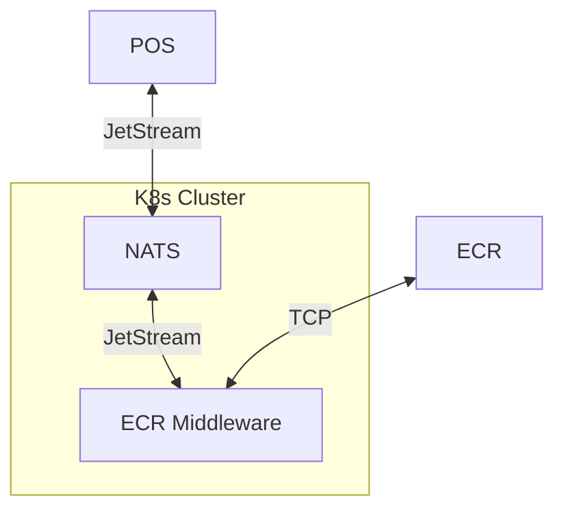
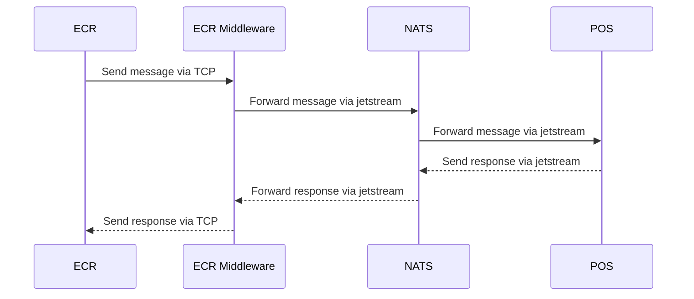

# ECR Middleware

A service for handling communication between ECR machines and POS devices.

## Architecture



## Flow



## Prerequisites

1. Install [`rust`]
2. Install [`docker`]

## Dev

To run the application in development mode, use the following command:

```
RUST_LOG=debug cargo run
```

## Docker

To start the application using Docker Compose, use the command:

```
docker compose up -d
```

To stop and remove the containers, use the command:

```
docker compose down
```

## Running tests

Some tests rely on [`testcontainers`] make sure docker is running.

To run all tests, use the following command:

```
cargo test
```

### Running a specific test

To run a specific test (e.g., a test named multiple), use the command:

```
cargo test --test multiple
```

[`rust`]: https://www.rust-lang.org/tools/install
[`docker`]: https://docs.docker.com/engine/install/
[`testcontainers`]: https://docs.rs/crate/testcontainers/latest
